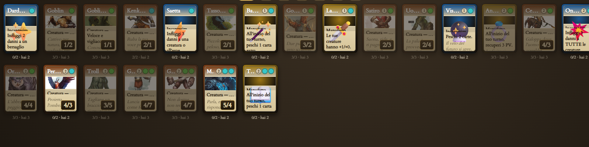
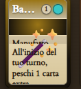

1. quando si compra un pacchetto, le carte devono vedersi al contrario (si vede la cover) e il player clicca su ogni singola carta per girarle (fai un bell´effetto) o sul pulsante "scopri tutte"

2. quando clicco per reset tgc, non deve toccare le monete, deve solo rimuovere tutte le carte a tutti i player, e dare la possibilitá, al primo login, di scegliere un deck dei 4 elementi base (possibilitá unica)

3. io da master devo poter aggiungere coin a chi voglio, dal pannello "platinummp admin (una cosa del genere)" (forse in quel pannello posso aggiungere monete bestia, una cosa dekl genere, modifica con queste monete)

4.  devo poter sempre ingrandire una carta per leggere tutto.

5. l´anteprima delle carte in "mazzo" o altrove, (ovvero come si vede la carta normalmente) se é troppo piccola si vede malissimo , aggiusta su smartphone magari la descrizione deve essere piú piccola e leggibile meglio quando ingrandita, su pc ingrandisci le carte, c´é spazio

6. quando ingrandisco una carta l´abilitá deve apparire lateralmente, come floating text

7. controlla che ci siano le abilitá passive delle carte (difensore, tocco letale, ecc), creane almeno 10-15 e che siano ispirate a dnd

8. ogni pacchetto deve avere un solo elemento e carte solo di quell´elemento

9. in un pacchetto escono 15 carte, di raritá diversa e con probabilitá sempre piú bassa per le raritá maggiori

10. controlla che ci siano le raritá delle carte, altrimenti creane 5 (per riconoscerle crea dei simboli, magari un pallino piccolo e colorato in modi diversi che sia nella carta)

11. C:\Users\KalEl\Desktop\PortfolioOrpheus\eldoria-web\public\assets\tgc_card qui ci sono delle carte chiamate ancora "screenshot.....", modifica il nome in base a ció che vedi nel disegno e inseriscile come carte. 

12. in battaglia, rendi piú visibile e lento l´attacco e difesa, per far capire bene cosa sta succedendo alle carte. 

13. aggiungi l´effetto (se non c´é giá ) come magic che escono le frecce sulle carte che attaccano, e le frecce con traiettore per le carte che difendono per capire a chi stanno difendendo o attaccando

ovviamente aggiorna negozio e manuale